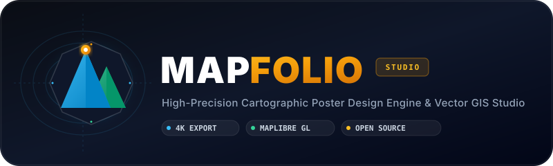

<div align="center">

  

  <p align="center">
    <strong>The Open-Source, High-Precision Cartographic Poster Design Studio &amp; Vector GIS Engine</strong>
  </p>

  <p align="center">
    <a href="https://github.com/Anurag-amrev-7557/mapfolio/blob/main/LICENSE">
      
    </a>
    <a href="https://react.dev/">
      
    </a>
    <a href="https://www.typescriptlang.org/">
      
    </a>
    <a href="https://maplibre.org/">
      
    </a>
    <a href="https://vitejs.dev/">
      
    </a>
    <a href="https://tailwindcss.com/">
      
    </a>
  </p>

  <p align="center">
    <a href="#-key-features">Key Features</a> •
    <a href="#-quick-start">Quick Start</a> •
    <a href="#-architecture--tech-stack">Tech Stack</a> •
    <a href="#-poster-export-engine">Export Engine</a> •
    <a href="#-deployment">Deployment</a> •
    <a href="#-contributing">Contributing</a>
  </p>

</div>

---

## 🧭 What is Mapfolio?

**Mapfolio** is an open-source, studio-grade cartographic poster design engine. It empowers designers, runners, cyclists, travelers, and GIS enthusiasts to transform real-world geospatial data into **museum-grade, high-resolution wall art posters** with custom typography, route tracks, point markers, and curated aesthetic color themes.

Unlike standard screenshot tools, Mapfolio features a **direct-to-canvas rendering engine** that renders all vector layers, raster hillshading, typography overlays, route waypoints, and graphic accents onto a 1:1 master HTML5 canvas at up to **4K / 300 DPI print quality**.

```
   ┌─────────────────────────────────────────────────────────────────────────────┐
   │                            MAPFOLIO PRO STUDIO                              │
   ├───────────────────────┬─────────────────────────────┬───────────────────────┤
   │  VECTOR GIS ENGINE    │     POSTER COMPOSITOR       │   HIGH-DPI EXPORTER   │
   │  • MapLibre GL v3     │     • Curated Themes        │   • 300 DPI Canvas    │
   │  • OpenFreeMap Tiles  │     • Google Fonts Overlays │   • PNG / JPEG / WebP │
   │  • OSRM Road Snapping │     • Aspect Ratio Frames   │   • 4K Print Ready    │
   │  • GPX Track Parser   │     • Dynamic Vignettes     │   • 1:1 Scale-Proof   │
   └───────────────────────┴─────────────────────────────┴───────────────────────┘
```

---

## ✨ Key Features

### 🖼️ Precision Poster Canvas & Layout Studio
- **Curated Framing Presets**: Classic Portrait `4:5`, Gallery Square `1:1`, Cinema `16:9`, Panoramic `21:9`, Modern `2:3`, and ISO Paper formats (`A1`, `A2`, `A3`, `A4`).
- **Typographic Overlays**: Clean minimalist titles, subheadings, latitude/longitude coordinate ribbons, and divider line accents.
- **Fine-Grain Font Controls**: 18+ paired designer Google Fonts (Bebas Neue, Playfair Display, Cinzel, Space Grotesk, Cormorant Garamond, Outfit, etc.) with custom tracking, leading, and letter spacing.
- **Gradient Vignettes**: Top and bottom soft gradient overlays ensuring text readability across high-contrast basemaps.

### 🎨 Curated Color Schemes & Custom Theme Engine
- **Preset Palettes**: Noir, Minimal Slate, Vintage Sepia, Cyberpunk Neon, Terracotta, Midnight Ocean, Japanese Forest, Blueprint, Warm Sand, and Nordic Minimal.
- **Per-Layer Paint Customization**: Override individual colors for land, water, waterways, parks, buildings, roads (motorways, primary, secondary, paths), and rail tracks.
- **Layer Visibility Toggles**: Toggle individual vector layers on/off in real-time (buildings, terrain, waterways, railways, roads).

### 🚴 Road-Snapped Route Builder & GPX Track Visualizer
- **OSRM Road Network Snapping**: Place interactive waypoints that automatically snap to driving, cycling, or walking road networks.
- **Strava / Garmin GPX File Import**: Drag-and-drop `.gpx` files from fitness apps to render marathon, cycling, and hiking routes.
- **Dynamic Path Styling**: Choose solid, dashed, dotted, or neon glowing route strokes with custom widths and numbered waypoint badges.

### 📍 Multi-Style Location Markers & Pins
- **Icon Variety**: Classic Map Pin, Dot Badge, Crosshair, Target Scope, Star, Heart, Home, Landmark, and Custom SVG Upload.
- **Per-Marker Customization**: Customize size (`16px` to `256px`), marker color, and floating typography tags for any landmark.
- **Animated Halo**: Pulsing focus ring highlight on active markers.

### 🖨️ 4K / 300 DPI Master Poster Export Engine
- **Direct Canvas Compositing**: Eliminates CSS transform scaling distortions and `html-to-image` alignment bugs by painting directly onto an off-screen high-DPI raster canvas.
- **Multiple Formats**: Export crisp, print-ready files in `PNG`, `JPEG`, and `WebP` formats.
- **Zero Token Friction**: Works immediately out-of-the-box powered by global [OpenFreeMap](https://openfreemap.org/) planet vector tiles — no credit card or paid Mapbox token required.

---

## ⚡ Quick Start

### Prerequisites
- [Node.js](https://nodejs.org/) `>= 18.0.0`
- [npm](https://www.npmjs.com/) `>= 9.0.0`

### 1. Clone the Repository
```bash
git clone https://github.com/Anurag-amrev-7557/mapfolio.git
cd mapfolio
```

### 2. Install Dependencies
```bash
npm install
```

### 3. Start Development Server
```bash
npm run dev
```

Open your browser and navigate to `http://localhost:5173`.

---

## 🛠️ Architecture & Tech Stack

```
                                  ┌───────────────────────────────┐
                                  │      React 19 + TypeScript    │
                                  │        (Vite 5 Bundler)       │
                                  └───────────────┬───────────────┘
                                                  │
                  ┌───────────────────────────────┼───────────────────────────────┐
                  ▼                               ▼                               ▼
       ┌─────────────────────┐         ┌─────────────────────┐         ┌─────────────────────┐
       │   Zustand Store     │         │  MapLibre GL v3     │         │   Master Canvas     │
       │  (State Management) │         │ (Vector GIS Engine) │         │ (Export Compositor) │
       └──────────┬──────────┘         └──────────┬──────────┘         └──────────┬──────────┘
                  │                               │                               │
                  ▼                               ▼                               ▼
       • Viewport & Layout State       • OpenFreeMap Vector Tiles      • 4K Raster Compositing
       • Theme & Color Overrides       • Dynamic Styling Pipeline      • 300 DPI Print Rendering
       • Markers & GPX Routes          • WebGL 3D Pitch & Bearing      • Lossless PNG / JPEG
```

| Layer | Technology | Purpose |
| :--- | :--- | :--- |
| **Framework** | [React 19](https://react.dev/) + [TypeScript](https://www.typescriptlang.org/) | Reactive UI component architecture and strict type safety |
| **Bundler** | [Vite 5](https://vitejs.dev/) | Lightning-fast HMR and optimized production bundling |
| **Map Engine** | [MapLibre GL v3](https://maplibre.org/) + [@visgl/react-map-gl](https://visgl.github.io/react-map-gl/) | Hardware-accelerated WebGL vector tile map renderer |
| **Tile Source** | [OpenFreeMap](https://openfreemap.org/) (OpenMapTiles) | Open-source, global vector tile infrastructure |
| **State** | [Zustand](https://github.com/pmndrs/zustand) | Centralized, reactive state store with zero boilerplate |
| **Styling** | [Tailwind CSS v4](https://tailwindcss.com/) | Modern atomic utility design system |
| **Icons** | [Lucide React](https://lucide.dev/) | Clean, consistent vector icon set |
| **Routing** | [OSRM Public API](http://project-osrm.org/) | Real-time road network routing for driving, cycling, and walking |

---

## 📁 Project Structure

```
mapfolio/
├── public/
│   ├── favicon.svg             # Vector site favicon
│   ├── logo.svg                # Master project logo & banner
│   └── maplibre-gl-worker.mjs  # MapLibre Web Worker thread
├── src/
│   ├── components/
│   │   ├── PosterMap.tsx       # Live MapLibre GL map viewport
│   │   ├── IconNavSidebar.tsx  # Floating vertical tool navigation bar
│   │   ├── ThemeSelector.tsx   # Color palette & custom override picker
│   │   ├── LayoutSelector.tsx  # Poster frame dimensions & aspect ratios
│   │   ├── RouteBuilder.tsx    # GPX track uploader & OSRM road snapper
│   │   ├── MarkerManager.tsx   # Custom map pin & icon badge controls
│   │   └── ExportModal.tsx     # High-resolution poster render dialog
│   ├── constants/
│   │   ├── fonts.ts            # Google Fonts typography catalog
│   │   ├── layouts.ts          # Aspect ratio presets & paper sizes
│   │   └── themes.ts           # Curated theme color palettes
│   ├── store/
│   │   └── useMapStore.ts      # Zustand global application state
│   ├── utils/
│   │   ├── generateMapStyle.ts # Dynamic MapLibre style JSON compiler
│   │   └── mapExport.ts        # 4K master canvas export engine
│   ├── App.tsx                 # Root application container
│   ├── index.css               # Global Tailwind CSS and keyframe animations
│   └── main.tsx                # Application entry point
├── package.json
├── tsconfig.json
└── vite.config.ts
```

---

## 🖨️ Poster Export Engine

Mapfolio implements a dedicated canvas compositor in [`src/utils/mapExport.ts`](src/utils/mapExport.ts) to solve the notorious scaling and text-blur issues of traditional browser print tools:

1. **Off-Screen High-Resolution Canvas**: Allocates a canvas buffer sized precisely to target print dimensions (e.g. `2400 × 3000` px for `4:5` 300 DPI).
2. **WebGL Frame Capture**: Renders the active MapLibre GL WebGL context directly onto the destination canvas with `preserveDrawingBuffer: true`.
3. **Typography Rasterization**: Computes vector font metrics, kerning, and line-spacing to composite typography cleanly over the map.
4. **Vignettes & Decorative Elements**: Renders gradients, border frames, scale bars, north compass arrows, and route statistics.
5. **Direct Download Stream**: Generates a high-quality data blob for instantaneous browser download.

---

## 🌐 Deployment

### Deploy to Cloudflare Pages (Recommended)

1. Connect your GitHub repository in the [Cloudflare Dashboard](https://dash.cloudflare.com/) under **Workers & Pages → Create application → Pages**.
2. Configure your build settings:
   - **Framework preset**: `Vite`
   - **Build command**: `npm run build`
   - **Build output directory**: `dist`
   - **Node.js Version**: `18` or higher
3. Click **Save and Deploy**.

### Deploy via Wrangler CLI
```bash
npm run build
npx wrangler pages deploy dist --project-name=mapfolio
```

### Docker Deployment
```bash
# Build Docker image
docker build -f Dockerfile.frontend -t mapfolio-frontend .

# Run container
docker run -p 80:80 mapfolio-frontend
```

---

## 🤝 Contributing

Contributions make the open-source community an incredible place to learn, inspire, and create! Any contributions you make are **greatly appreciated**.

1. Fork the Project
2. Create your Feature Branch (`git checkout -b feature/AmazingFeature`)
3. Commit your Changes (`git commit -m 'Add some AmazingFeature'`)
4. Push to the Branch (`git push origin feature/AmazingFeature`)
5. Open a Pull Request

---

## 📄 License

Distributed under the **MIT License**. See [`LICENSE`](LICENSE) for more information.

---

<div align="center">
  <p>Crafted with precision for cartography lovers worldwide.</p>
  <p>⭐ Star us on GitHub if you love Mapfolio!</p>
</div>
