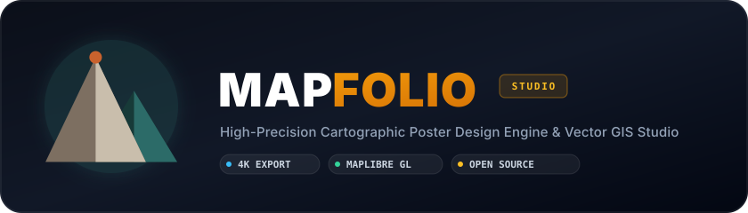
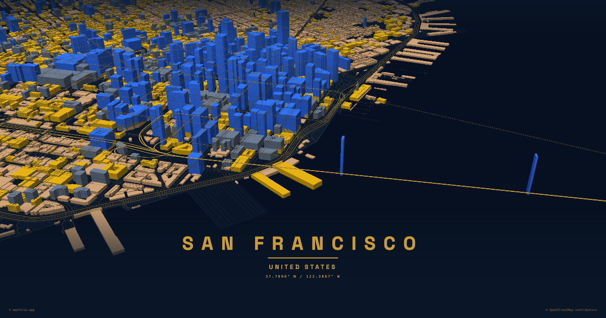
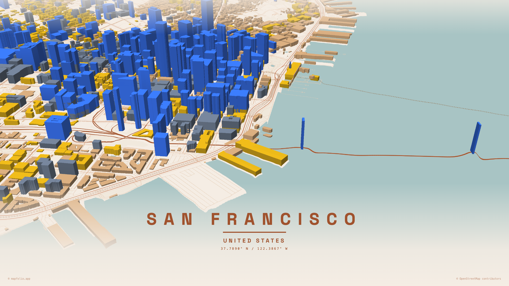
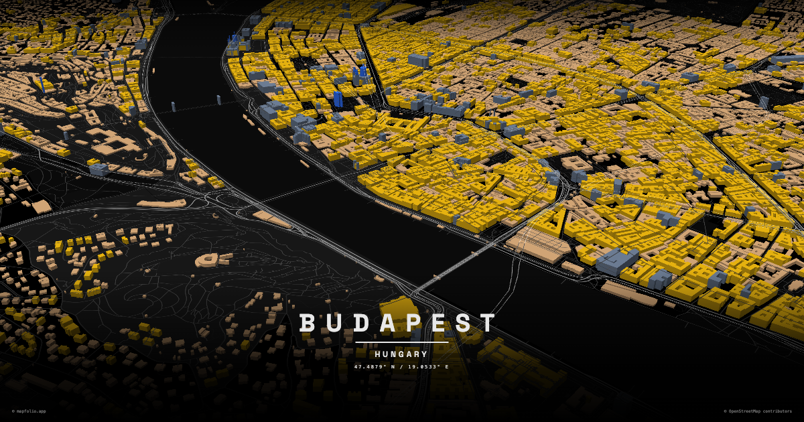
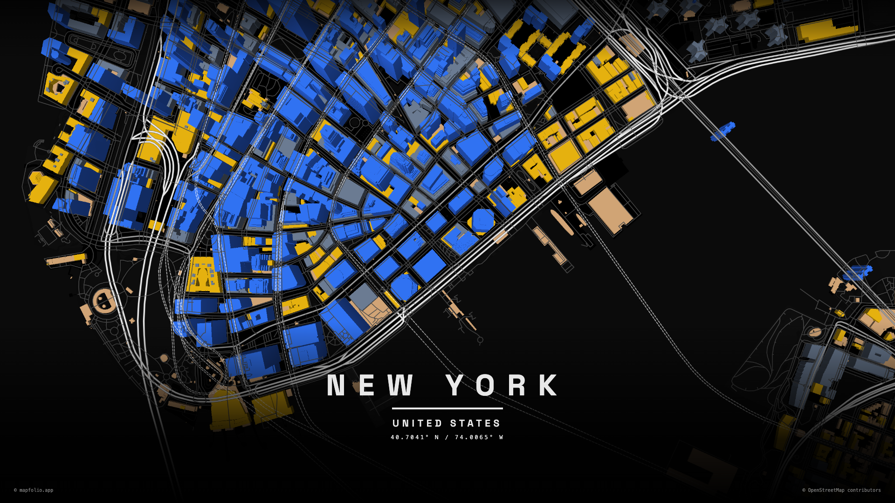

<div align="center">

  

  <br />
  <br />

  <p align="center">
    <strong>The studio-grade, open-source cartographic poster design engine &amp; vector GIS platform.</strong>
    <br />
    <em>Transform real-world geospatial data and GPX tracks into museum-quality, 4K / 300 DPI print-ready wall art.</em>
  </p>

  <p align="center">
    <a href="https://github.com/Anurag-amrev-7557/mapfolio/actions/workflows/ci.yml">
      
    </a>
    <a href="https://github.com/Anurag-amrev-7557/mapfolio/blob/main/LICENSE">
      
    </a>
    <a href="https://react.dev/">
      
    </a>
    <a href="https://www.typescriptlang.org/">
      
    </a>
    <a href="https://maplibre.org/">
      
    </a>
    <a href="https://vitejs.dev/">
      
    </a>
    <a href="https://tailwindcss.com/">
      
    </a>
  </p>

  <p align="center">
    <a href="#-overview">Overview</a> •
    <a href="#-gallery--print-showcase">Gallery</a> •
    <a href="#-why-mapfolio">Why Mapfolio?</a> •
    <a href="#-feature-matrix">Features</a> •
    <a href="#-interactive-controls--shortcuts">Shortcuts</a> •
    <a href="#-architecture--engine">Architecture</a> •
    <a href="#-quick-start">Quick Start</a> •
    <a href="#-deployment">Deployment</a> •
    <a href="#-community--contributing">Contributing</a>
  </p>

</div>

---

## 🧭 Overview

**Mapfolio** is a modern, high-precision cartographic workstation built from the ground up for designers, runners, cyclists, travelers, architects, and GIS enthusiasts.

Traditional poster creators rely on browser screenshots or lossy DOM rasterizers that produce pixelated typography, blurred line weights, and misaligned coordinates. Mapfolio solves this with a **dedicated Direct-to-Canvas 4K Compositor** that rasterizes vector map tiles, road geometries, custom fonts, route waypoints, and decorative accents onto a master 300 DPI graphics buffer.

```
┌──────────────────────────────────────────────────────────────────────────────────────────────────┐
│                                       MAPFOLIO WORKSTATION                                       │
├───────────────────────────────┬──────────────────────────────────┬───────────────────────────────┤
│       VECTOR GIS CORE         │       POSTER COMPOSITOR          │      MASTER EXPORT ENGINE     │
│  • MapLibre GL v3 Engine      │  • 12+ Curated Theme Palettes    │  • 4K Ultra-HD Resolution     │
│  • OpenFreeMap Global Tiles   │  • 18+ Designer Google Fonts     │  • 300 DPI Print Quality      │
│  • OSRM Real-Time Routing     │  • Aspect Ratio Presets (1:1/4:5)│  • Direct-to-Canvas Buffer    │
│  • Strava/Garmin GPX Parser   │  • Dynamic Gradient Vignettes    │  • Lossless PNG, JPEG & WebP  │
│  • Zero-Token Open Source     │  • Custom Vector Markers & Pins  │  • Scale-Proof Pixel Layout   │
└───────────────────────────────┴──────────────────────────────────┴───────────────────────────────┘
```

---

## 📸 Gallery & Print Showcase

Explore real 4K / 300 DPI exports rendered directly with Mapfolio's vector engine across global cities:

<p align="center"></p>

<p align="center"></p>

---

## ⚡ Why Mapfolio?

| Capability | **Mapfolio Studio** | Generic Screenshot Tools | Paid Commercial SaaS |
| :--- | :---: | :---: | :---: |
| **Output Resolution** | 🟢 **4K UHD (300 DPI Canvas)** | 🔴 72 DPI (Screen Grab) | 🟡 300 DPI (Paid Export) |
| **Tile Infrastructure** | 🟢 **OpenFreeMap (0 Tokens)** | 🔴 Raster Screenshots | 🟡 Mapbox (Paid Token Req.) |
| **GPX & Strava Tracks** | 🟢 **Road-Snapped (OSRM)** | 🔴 Not Supported | 🟡 Basic Overlay |
| **Layer & Paint Control** | 🟢 **Full RGB Hex Overrides** | 🔴 None | 🟡 Limited / Preset Only |
| **Typography Engine** | 🟢 **18+ Paired Google Fonts** | 🔴 System Defaults | 🟡 Fixed Templates |
| **3D Building Extrusions** | 🟢 **Real-time WebGL (60 FPS)** | 🔴 2D Flat Only | 🟡 Static 2.5D |
| **License & Pricing** | 🟢 **100% Free & MIT Licensed** | 🔴 Closed Source | 🔴 Monthly Subscription |

---

## ✨ Feature Matrix

### 🗺️ Vector Cartographic Canvas
- **Global OpenFreeMap Tiles**: Full worldwide vector map data powered by OpenMapTiles and OpenFreeMap. Instant loading with zero required API keys.
- **Hardware-Accelerated WebGL**: Fluid 60 FPS viewport with dynamic pitch, bearing, continuous zoom, and regional overview background viewing.
- **Layer Visibility Granularity**: Real-time toggling for terrain hillshading, waterways, railway networks, primary/secondary highways, and 3D building extrusions.

### 🎨 Curated Design Themes & Custom Palette Engine
- **Designer Presets**:
  - `Noir Dark` — Deep obsidian contrast for modern interiors.
  - `Minimal Slate` — Refined architectural grayscale aesthetic.
  - `Vintage Sepia` — Classic aged parchment and copper hues.
  - `Cyberpunk Neon` — Electric magenta and cyan glow lines.
  - `Terracotta` — Warm Mediterranean clay and earth tones.
  - `Midnight Ocean` — Nautical navy with bright cobalt water accents.
  - `Nordic Minimal`, `Blueprint`, `Japanese Forest`, `Warm Sand` & more.
- **Color Override Engine**: Complete individual color control over land, water bodies, waterways, parks, aeroways, buildings, roads (motorways, primary, secondary, paths), and rail tracks.

### 🚴 Road-Snapped Route Builder & GPX Track Visualizer
- **OSRM Intelligent Snapping**: Click waypoints on the map to automatically trace accurate road paths for **Driving**, **Cycling**, or **Walking**.
- **GPX File Drag-and-Drop**: Import athletic activities directly from **Strava**, **Garmin Connect**, **Komoot**, or **AllTrails**.
- **Path Customization**: Adjust stroke width (`1px` to `64px`), line color, dashed/dotted/neon-glow casing, and numbered waypoint marker badges.

### 📍 Custom Map Pins & Landmark Badges
- **Icon Catalog**: Classic Pin, Dot Marker, Crosshair, Target Scope, Star, Heart, Home, Landmark, Compass, and Custom Image Uploads.
- **Dynamic Sizing**: Smooth scale presets (`SM`, `MD`, `LG`, `XL`, `2XL`, `3XL`) or continuous pixel sizing (`16px` – `256px`).
- **Floating Labels**: High-contrast, typography-scaled custom text badges attached to any pinpointed coordinate.

### 🖨️ Pixel-Perfect 4K Master Export Engine
- **Direct-to-Canvas Compositing**: Eliminates CSS transform scaling distortions and `html-to-image` top-left alignment bugs by painting directly onto an off-screen high-DPI raster canvas.
- **Standard Poster Formats**:
  - `Classic Portrait` (`4:5`)
  - `Modern Portrait` (`2:3`)
  - `Gallery Square` (`1:1`)
  - `Cinema Wide` (`16:9`)
  - `Panoramic Landscape` (`21:9`)
  - `ISO Standards` (`A1`, `A2`, `A3`, `A4`)
- **Lossless Output Formats**: Instant download in `PNG`, `JPEG`, and `WebP` with configurable quality parameters.

---

## ⌨️ Interactive Controls & Shortcuts

Mapfolio includes an ergonomic floating HUD and keyboard shortcuts for rapid studio workflow:

| Key | Tool / Action | Description |
| :---: | :--- | :--- |
| <kbd>1</kbd> | **Theme Studio** | Open curated palettes and individual layer paint controls |
| <kbd>2</kbd> | **Layout & Frame** | Select aspect ratios, dimensions, borders, and margins |
| <kbd>3</kbd> | **Typography** | Configure titles, subtitles, coordinates, and font families |
| <kbd>4</kbd> | **Route Builder** | Draw road-snapped paths or drag-and-drop GPX activity files |
| <kbd>5</kbd> | **Location Pins** | Place and customize landmark markers, icons, and labels |
| <kbd>6</kbd> | **Layer Visibility**| Toggle terrain, buildings, roads, waterways, and railways |
| <kbd>7</kbd> | **Export Dialog** | Open master 4K / 300 DPI canvas export settings |
| <kbd>Space</kbd> | **Lock Viewport** | Lock map movement to prevent accidental panning while designing |
| <kbd>R</kbd> | **3D Rotation** | Toggle 3D pitch and bearing tilt controls |

---

## 🏗️ Architecture & Engine

```
                             ┌───────────────────────────────────┐
                             │      React 19 + TypeScript        │
                             │         (Vite 5 Bundler)          │
                             └─────────────────┬─────────────────┘
                                               │
               ┌───────────────────────────────┼───────────────────────────────┐
               ▼                               ▼                               ▼
    ┌──────────────────────┐        ┌──────────────────────┐        ┌──────────────────────┐
    │     Zustand Store    │        │    MapLibre GL v3    │        │     Master Canvas    │
    │  • Coordinates & Zoom│        │  • OpenFreeMap Planet│        │  • 4K Raster Buffer  │
    │  • Color Overrides   │───────►│  • Dynamic Style Spec│───────►│  • Vector Font Metric│
    │  • GPX Waypoints     │        │  • WebGL Render Loop │        │  • Direct PNG Export │
    │  • Active Framing    │        │  • OSRM Road Snapper │        │  • Vignette Overlays │
    └──────────────────────┘        └──────────────────────┘        └──────────────────────┘
```

### Module Overview

- **`src/components/PosterMap.tsx`**: High-performance MapLibre GL wrapper utilizing `react-map-gl/maplibre` with WebGL viewport sync and vector feature snapping.
- **`src/utils/generateMapStyle.ts`**: Pure function compiler converting palette state into dynamic MapLibre Style Specification JSON with OpenFreeMap vector layers.
- **`src/utils/mapExport.ts`**: Master export compositor rendering map frames, vector paths, SVG badges, and Google typography directly to a 300 DPI HTML5 canvas.
- **`src/store/useMapStore.ts`**: High-throughput Zustand store managing viewport parameters, color overrides, markers, and custom themes.

---

## 🚀 Quick Start

### 1. Clone the Repository
```bash
git clone https://github.com/Anurag-amrev-7557/mapfolio.git
cd mapfolio
```

### 2. Configure Environment (Optional)
```bash
cp .env.example .env
```

### 3. Install Dependencies
```bash
npm install
```

### 4. Start Development Server
```bash
npm run dev
```

The application will be running locally at `http://localhost:5173`.

### 5. Build for Production
```bash
npm run build
```

---

## 🌐 Deployment

### Cloudflare Pages (Recommended)

1. Connect your repository in the [Cloudflare Dashboard](https://dash.cloudflare.com/) under **Workers & Pages → Create application → Pages**.
2. Configure build settings:
   - **Framework preset**: `Vite`
   - **Build command**: `npm run build`
   - **Build output directory**: `dist`
   - **Node.js Version**: `18` or higher
3. Click **Save and Deploy**.

### One-Command Wrangler CLI Deploy
```bash
npm run build
npx wrangler pages deploy dist --project-name=mapfolio
```

### Docker Deployment
```bash
# Build Docker image
docker build -f Dockerfile.frontend -t mapfolio .

# Run container on port 80
docker run -d -p 80:80 --name mapfolio-app mapfolio
```

---

## 🤝 Community & Contributing

Contributions make the open-source community an incredible place to learn, inspire, and create!

- 📖 **[Contributing Guide](CONTRIBUTING.md)** — Workflow, branching, and pull request standards.
- 🛡️ **[Security Policy](SECURITY.md)** — Coordinated vulnerability disclosure guidelines.
- 📜 **[Code of Conduct](CODE_OF_CONDUCT.md)** — Contributor Covenant 2.1 community standards.
- 🐛 **[Report a Bug](https://github.com/Anurag-amrev-7557/mapfolio/issues/new?template=bug_report.yml)**
- ✨ **[Request a Feature](https://github.com/Anurag-amrev-7557/mapfolio/issues/new?template=feature_request.yml)**

---

## 📈 Star History

<div align="center">
  <a href="https://star-history.com/#Anurag-amrev-7557/mapfolio&Date">
    <picture>
      <source media="(prefers-color-scheme: dark)" srcset="https://api.star-history.com/svg?repos=Anurag-amrev-7557/mapfolio&type=Date&theme=dark" />
      <source media="(prefers-color-scheme: light)" srcset="https://api.star-history.com/svg?repos=Anurag-amrev-7557/mapfolio&type=Date" />
      
    </picture>
  </a>
</div>

---

## 📄 License

Distributed under the **MIT License**. See [`LICENSE`](LICENSE) for complete details.

---

<div align="center">
  <p>Built with ❤️ for cartography &amp; design lovers worldwide.</p>
  <p>⭐ <strong>Star this repository if you find Mapfolio inspiring!</strong></p>
</div>
